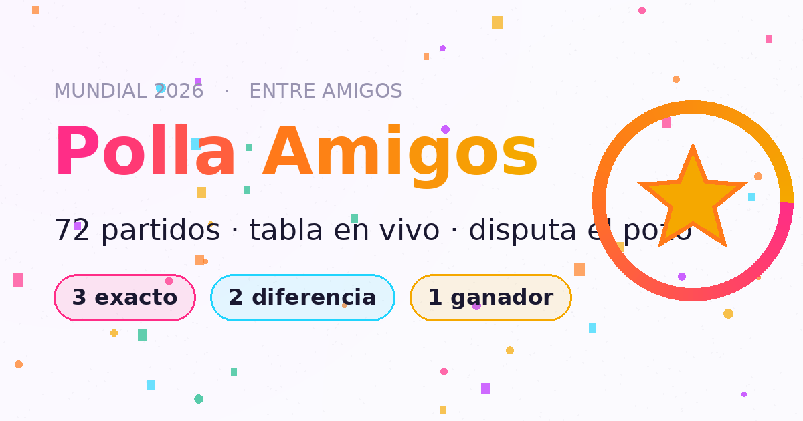

# ⚽ Polla Amigos · Mundial 2026



Polla entre amigos para la Copa del Mundo 2026, con un diseño limpio, festivo y muy cuidado en animaciones. Los participantes **no necesitan crear cuenta de nada**: abren el link, se inscriben con nombre y apellido, predicen los 72 partidos de la fase de grupos y confirman su jugada con un PIN propio. El administrador gestiona todo desde una **planilla de Google** (las predicciones llegan solas; él solo anota resultados y pagos) y la **tabla en vivo** se recalcula automáticamente.

## Reglas

La cuota de inscripción es de **$15.000 CLP**, pagadera al administrador hasta el día de la final (19 de julio); dentro de la app no se manejan datos bancarios, solo se indica que la cuota se coordina con el administrador. El pozo se reparte por mitades: premio del campeón y fondo de la fiesta final. Puntaje por partido: **3** resultado exacto · **2** diferencia de gol · **1** solo el ganador. Cada partido se cierra a su hora de inicio, con validación también en el servidor (y reloj sincronizado, así que no importa si un teléfono tiene la hora mal).

## Características

Diseño claro y festivo con una identidad propia (balón-firma, gradiente magenta–naranja–ámbar, grano sutil de marca). Splash de carga con la marca, cabecera que se colapsa al hacer scroll como una app nativa, transiciones deslizadas entre pestañas y grupos, stepper de marcador con microinteracciones y feedback háptico, explosión de confeti al confirmar, conteo animado del pozo, tabla en vivo con tu posición destacada y fijada al hacer scroll, medallas de podio con brillo, esqueletos de carga, identidad recordada en el dispositivo con PIN, PWA instalable (manifest + íconos), accesibilidad (foco visible, `aria-live`, `prefers-reduced-motion`) y **cero dependencias en producción**: HTML + CSS + JavaScript moderno en módulos.

## Estructura

```
├── render.yaml               # Blueprint de Render (sitio estático)
├── apps-script/Code.gs       # API en Google Apps Script (la planilla es la base de datos)
├── public/                   # Sitio publicado
│   ├── index.html
│   ├── css/estilos.css       # Sistema de diseño "Fiesta clara"
│   ├── js/
│   │   ├── config.js         # ← config del administrador (URL del Apps Script, cuota)
│   │   ├── datos.js          # Selecciones y fixture oficial (72 partidos)
│   │   ├── util.js           # Formato, puntaje, reloj sincronizado y cuentas regresivas
│   │   ├── api.js            # Cliente del Apps Script
│   │   ├── estado.js         # Estado de la aplicación
│   │   ├── ui.js             # Toasts, confeti, conteo del pozo, savebar, spinner
│   │   ├── vistas.js         # Inicio · Predicción · Tabla
│   │   └── app.js            # Render, eventos, transiciones y temporizadores
│   ├── img/                  # Íconos PWA + imagen para compartir (og.png)
│   └── favicon.svg
├── scripts/smoke.mjs         # Pruebas de lógica y vistas
├── INSTRUCCIONES.md          # Puesta en marcha paso a paso (~15 min)
└── CAMBIOS.md                # Historial de mejoras
```

## Puesta en marcha rápida

1. **Planilla + API:** crea una hoja en Google Sheets, pega `apps-script/Code.gs` en *Extensiones → Apps Script*, ejecuta `configurar` una vez y publica como *Aplicación web* (acceso: cualquier persona). Copia la URL `/exec`.
2. **Conectar:** pega esa URL en `public/js/config.js` (`API_URL`).
3. **Desplegar:** sube este repo a GitHub y en Render usa **New + → Blueprint** apuntando al repo (el `render.yaml` configura todo). Cada `git push` redespliega solo.

El detalle completo está en [INSTRUCCIONES.md](INSTRUCCIONES.md).

## Desarrollo local

```bash
npx serve public        # o cualquier servidor estático
node scripts/smoke.mjs  # pruebas de puntaje y vistas
```

## Créditos

Fixture oficial FIFA 2026 (fase de grupos). Tipografía del sistema (Inter / system-ui). Código bajo licencia MIT.
